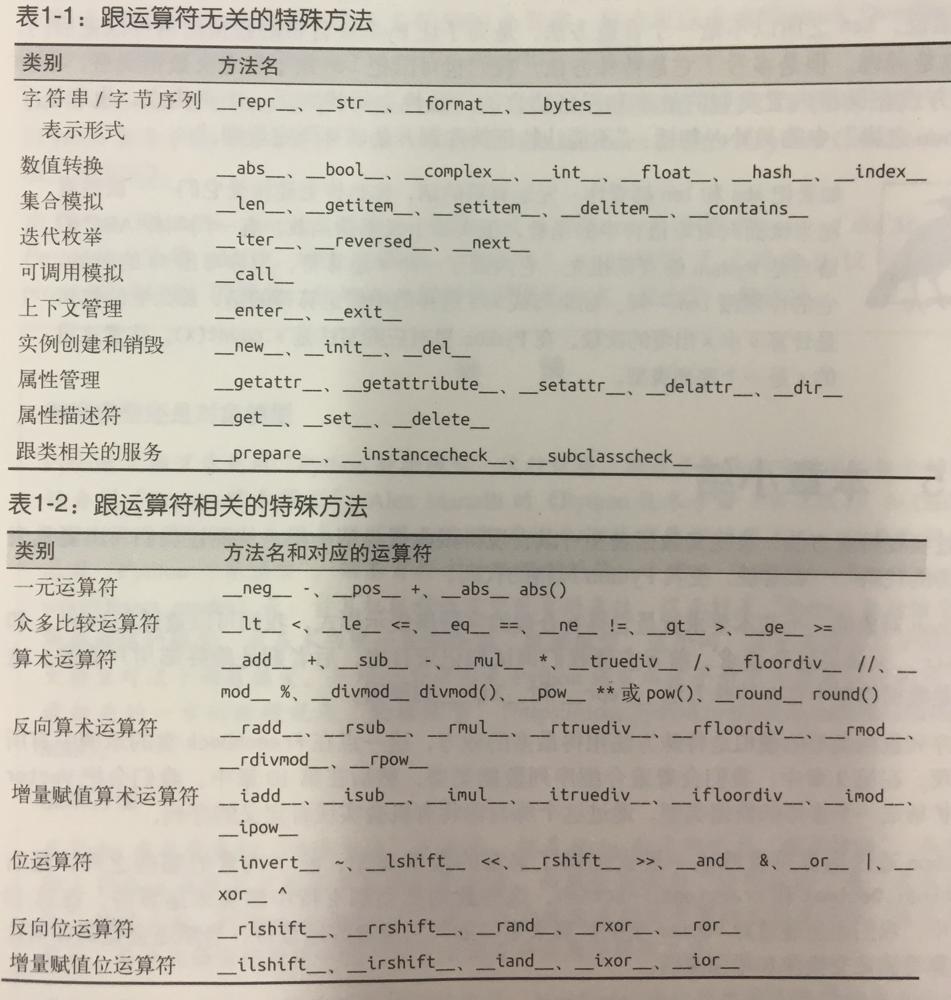

* python 最好的品质之一就是一致性

### 1.1 一摞python风格的纸牌

* 实现__getitem__和__len__这两个特殊方法。
* [代码](1_python数据模型/FenchDeck.py)


### 1.2 如何使用特殊方法



> 特殊方法是为了被python解释器调用的，

#### 模拟数值类型

* 实现向量（二维坐标）
* 利用数值运算符操作向量
* [code](1_python数据模型/Vector.py)

### 字符串表示形式

* repr将对象用字符串表达出来

#### 算术运算符

#### 自定义的布尔值

### 延伸阅读

* 《python技术手册》对数据模型的讲解很精彩
* 《ptyhon cookbook》对数据模型进行了详尽的介绍

### 杂谈

* 数据模型：计算机编程语言中对象的属性