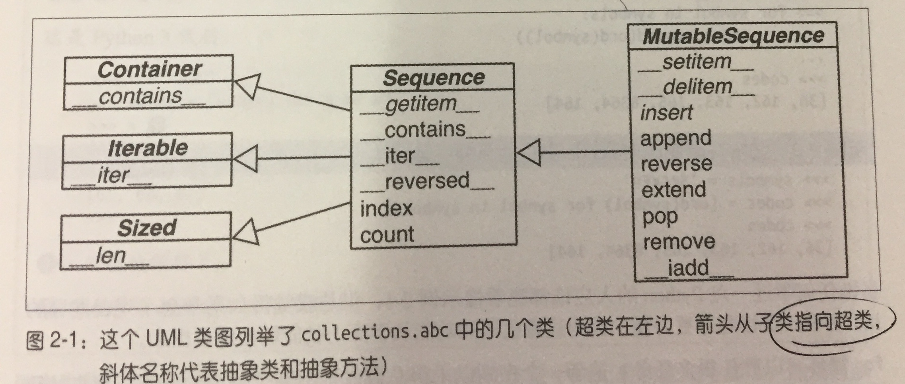
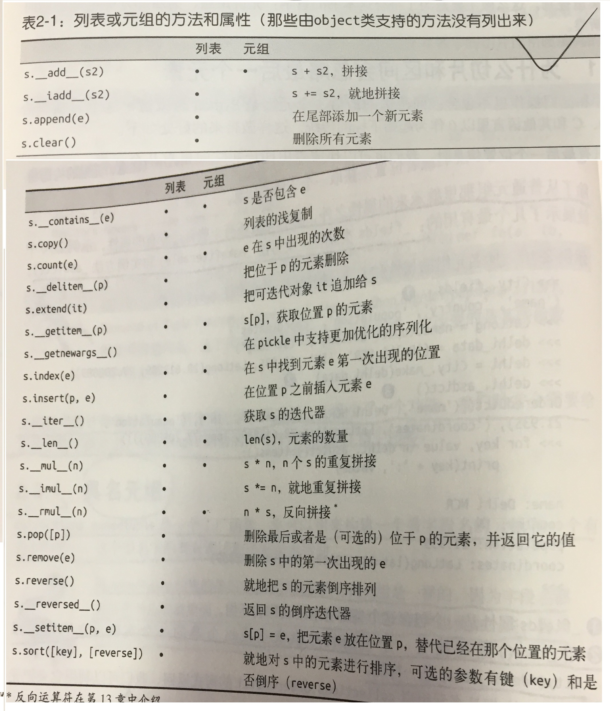

> 不管是哪种数据结构，字符串、列表、字节序列、数组、XML元素，亦或是数据库查询结果。它们都公用
一套丰富的操作：迭代，切片，排序，还有拼接

### 2.1 内置序列类型概览

* 按照存储元素类型分类
    * 容器序列 ：list，tuple和collection.deque这些序列能存放不同的数据类型数据
    * 扁平序列 ：str，bytes,memoryview和array.array,这类序列只能容纳一种类型
* 按照是否能够被修改来分类：
    * 可变序列： list,bytearray,array.array,collection.deque, memoryview
    * 不可变序列： tuple, str, bytes



> 通过记住这些类的共有特性，把可变和不可变或者容器与扁平序列的概念融汇贯通，在探索并学习新的序列
类型时，会更加得心应手。

* 列表推导是一种构建列表的方法，它异常强大，掌握列表推导可以帮助我们打开生成器表达式的大门，
后者是具有生成各种类型的元素并用它们来填充序列的功能。



### 2.2 列表推导和生成器表达式

* 列表推导是构建列表的快捷方式，而生成器表达式则可以用来创建其他任何类型的序列。


#### 列表推导和可读性

```
codes = [ord(symbol) for symbol in symbols]   # 列表推导
```
* 通常原则是，只用列表推导来创建新的列表，并且尽量保持简短，如果列表推导的代码超过了两行，你可能就要考虑是不是
需要用for循环重写了。
* 列表推导不会有变量泄漏问题，因为局部变量会销毁。
* 列表推导可以帮助我们把一个序列或者其他可迭代类型中的元素过滤或是加工，然后重新建一个列表。


#### 列表推导同`filter`和`map`比较

````
[ord(s) for s in symbols if ord(s) > 127]
等价于
list(filter(lambda c: c > 127, map(ord, symbols)))
````

#### 笛卡尔积

* 列表推导作用只有一个：生成列表


#### 生成器表达式

* 一次产生一个元素，节省内；
* 虽然也可以用列表推导来初始化元组，数组，或其他序列类型，但是生成器表达式是更好的选择。
这是因为生成器表达式背后遵守了迭代器协议，可以逐个产生元素，而不是先建立一个完整的列表，然后再把这个列表传递到某个构造函数里、
前面那种方法显然能够节省内存。



### 2.3 元组不仅仅是不可变的列表

* 元组是不可变列表
* 元组可以用于没有字段的记录。


### 元组和记录

* 元组其实是没有数据的记录:
    * 元组中每个元素都存放了记录中一个字段的数据，外加这个字段的位置。


#### 元组拆包

* `*`用法：
    * 运算符可以把一个迭代对象拆开
    ```
    divmod(20, 8)
    等价于
    t = (20, 8)
    divmod(*t)
    ```
    * 处理剩下的元素
    ```
    a, b, *rest = range(5)
    ```

#### 嵌套元组拆开

```
metro_areas = [
    ('Tokyo', 'JP', 36.933, (35.689722, 139.691667)),   
    ('Delhi NCR', 'IN', 21.935, (28.613889, 77.208889)),
    ('Mexico City', 'MX', 20.142, (19.433333, -99.133333)),
    ('New York-Newark', 'US', 20.104, (40.808611, -74.020386)),
    ('Sao Paulo', 'BR', 19.649, (-23.547778, -46.635833)),
]

print('{:15} | {:^9} | {:^9}'.format('', 'lat.', 'long.'))
fmt = '{:15} | {:9.4f} | {:9.4f}'
for name, cc, pop, (latitude, longitude) in metro_areas:  
    if longitude <= 0:  # <3>
        print(fmt.format(name, latitude, longitude))
```

* 元组已经设计很好用了，但作为记录来用的话，还是少了一个功能：我们时常会需要给记录中的字段命名。
* namedtuple函数的出现帮我们解决了这个问题。

### 具名元组

* `collections.namedtuple`是一个工厂函数，它可以用来构建一个带字段名的元组和一个有名字的类。
* 用`namedtuple`构建的类的实例所消耗的内存跟元组的一样，因为字段名都被存在于类里面。
这个实例和普通的对象实例比起来要小一些，因为python不会用 `__dict__`存放实例属性

```
Card = collection.namedtuple('Card', ['rank', 'suit'])  #创建实例
Card.rank   # 访问属性
```
* 除了从普通元组那里集成来的属性之外，具名元组还有一些自己专有的属性，
    * _fields类属性
    * _make（iterable）类方法: 通过接受一个可迭代对象来生成这个类的一个实例，它的作用跟City(*delhi_data)一样
    * 实例方法_asdict()
    ```
    >>> City._fields
    ('name', 'county', 'population', 'cordinates')
    >>> LatLong = namedtuple('LatLong', "lat long")
    >>> delhi_data = ('Delhi NCR', "IN", 21.935, LatLong(28.32, 77.43))
    >>> delhi = City._make(delhi_data)
    >>> delhi._asdict()
    ```
* 元组是一种很强大的可以当作记录来用的数据类型。
* 也可以充当一个不可变的列表

#### 作为不可变列表的元组





### 2.4 切片

#### 为什么切片和区间会忽略最后一个元素

#### 对对象的进行切片
```
slice(start, stop, step)  # 定义切片
price = slice(40, 52)
for item in items:
    print(item[price])  # 打印 40:52 之间的部分
```
#### 多维切片和省略

```
x[i, ...] 等价于  x[i, :, :, :]
```

#### 给切片赋值
```
l = list(range(10))
l[3 : 5] = [100] # 3 : 5 之间的编程一个 100，这里和numpy不一样
```


### 2.5 对序列使用 `+` 和 `*`

* `+` 和 `*` 都遵循这个规律，不修改原来的操作对象，而是构建一个全新的序列。
* 建议由列表组成的列表
```
>>> board = [['_'] * 3 for i in range(3)]
>>> board
['_', '_', '_'],  ['_', '_', '_'],  ['_', '_', '_']
>>> board[1][2] = 'X'
>>> board
['_', '_', '_'],  ['_', '_', 'X'],  ['_', '_', '_']

上面是正确写法， 下面是错误的
>>> board = [['_'] * 3 ] * 3  # 相当于
row = ['_'] = 3
board = []
for i in range(3):
    board.append(row) # 同一个对象赋值三次，没有意思
```
* 所以这里 `*`运算一定要注意里面是基本对象，还是引用


### 2.6 序列的增量赋值

查看语句字节码
```
dist.dis("s[a] += b")
```
* 不要把可变对象放在元组里面


### 2.7 list.sort方法和内置函数 sorted

* list.sort方法会就地排序列表，也就是说不会把原列表复制一份。这也是这个方法的返回值为None的原因，
提醒你本方法不会新建一个列表。在这种情况下返回None，其实是python的一个惯例。如果一个函数或者方法对对象进行的是
就地改动，那它就应该返回None，好让调试者知道传入的参数发生了变动，而且并未产生新对象。


### 2.8 用 `bisect`来惯例已排序的序列

### 用 bisect 来所有
```
bisect(haystack, needle)在haystack里搜索needle的位置
```
* [code](2_序列构成的数组/study_bisect.py)


### 2.9 当列表不是首先时

> 如果你的代码里，包含操作（比如检查一个元素是否出现在一个集合中），的频率很高，用set比较合适，
set转为检查元素是否存在做过优化，但不是它不是序列，因为set是无序的。


#### 数组

```
array.array('B', [1, 2, 3, 4])  # (c语言中的元素类型， 元素)
```

#### 内存视图

> `memoryview`是一个内置类，它能让用户在不复制内容的情况下操作同一个数组的不同切片。
* 内存视图其实是泛化和去数学化的Numpy数组，它让你在不需要复制内容的前提下，在数据结构之间共享内存；
* `memoryview.cast`的概念跟数组模块类似， 能用不同的方式读写同一块内存数据，而且内容自己不会随意移动。
```
>>> numbers = array.array('h', [-2, -1, 0, 1, 2])
>>> memv = memoryview(numbers)
>>> len(memv)
5
>>> memv[0]
-2
>>> memv_oct = memv.cast('B')
>>> memv_oct.tolist()
[244, 255, 255, 255, 0, 0, 1, 0, 2, 0]
>>> memv_oct[5] = 4
>>> numbers
arrray('h', [-2, -1, 1024, 1, 2])  # 第五号元素高字节被修改
```

#### numpy和scipy

* numpy实现了多维同质数组和矩阵
* scipy是基于numpy的另一个库，它提供了很多和科学计算有关的算法。


#### 双向队列和其他形式的队列

* collection.deque类是一个线程安全，可以快速从两端添加或者删除元素的数据类型。


#### 除了 deque 之外， 还有些其他的 Python 标准库也有对队列的实现。

* queue ：
提供了同步（ 线程安全） 类 Queue、 LifoQueue 和PriorityQueue， 不同的线程可以利用这些数据类型来交换信息。 
这三个类的构造方法都有一个可选参数 maxsize， 它接收正整数作为输入值， 用来限定队列的大小。
但是在满员的时候， 这些类不会扔掉旧的元素来腾出位置。 相反， 如果队列满了， 它就会被锁住， 
直到另外的线程移除了某个元素而腾出了位置。这一特性让这些类很适合用来控制活跃线程的数量。

* multiprocessing ： 
这个包实现了自己的 Queue， 它跟 queue.Queue 类似， 是设计给进程间通信用的。
同时还有一个专门的multiprocessing.JoinableQueue 类型， 可以让任务管理变得更方便。

* asyncio ： 
Python 3.4 新提供的包， 里面有Queue、 LifoQueue、 PriorityQueue 和 JoinableQueue， 
这些类受到 queue 和 multiprocessing 模块的影响， 但是为异步编程里的任务管理提供了专门的便利。


### 2.10 本章小结

* python序列类型最常见的分类就是可变和不可变序列。但另外一种分类方式也很有用，那就是把它们分为扁平序列和容器序列，
前者体积小，速度快，操作简单，但只能是原子性数据；
* 列表推导和生成器表达式则提供了灵活构建和初始化序列的方式。
* 元组在python里扮演两个角色
    * 它既可以用作无名称的字段记录，又可以看做不可变列表；
    * 元组被当做记录来用的时候，拆包是最安全可靠的从元组中提取不同字段信息的方式。
* 元组的本质：存放不同类型的元素，元组就是用作存放彼此间没有关系的数据的记录。

    




