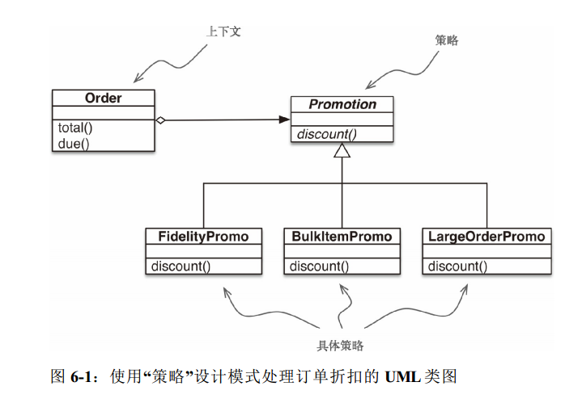
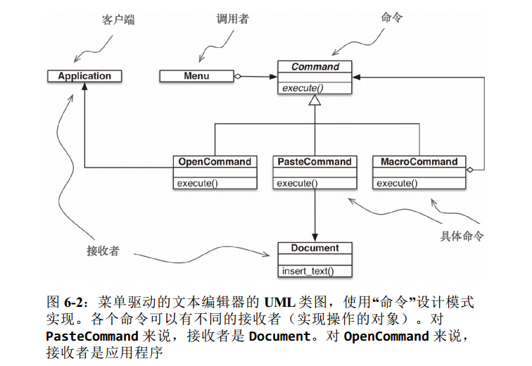

### 6.1 案例分析：重构“策略”模式

#### 经典的“策略”模式



* 策略模式：
定义一系列算法、把它们一一封装起来，并且使他们可以相互替换，本模式使得算法可以独立于使用它们的客户而变化。

* 上下文：把一些计算委托给实现不同算法的相互换组件，它提供服务。
* 策略：实现不同算法的组件共同的接口
* 具体策略：实现具体的策略，具体策略由上下文类的用户选择
* 用类集成方法，实现的策略模式： 
[first design](6_使用一等函数实现设计模式/first.py)

* 声明抽象基类最简洁的方式是子类化abc.ABC，
* 利用python中的作为对象的函数，可以使用更少的代码实现相同的功能


#### 使用函数实现“策略”模式

```
def fidelity_promo(order): 
    """为积分为1000或以上的顾客提供5%折扣"""
    return order.total() * .05 if order.customer.fidelity >= 1000 else 0
    
def bulk_item_promo(order):
    """单个商品为20个或以上时提供10%折扣"""
    discount = 0
    for item in order.cart:
    if item.quantity >= 20:
    discount += item.total() * .1
    return discount
    
def large_order_promo(order):  #类作为函数的参数，函数作为类的参数
    """订单中的不同商品达到10个或以上时提供7%折扣"""
    distinct_items = {item.product for item in order.cart}
    if len(distinct_items) >= 10:
         return order.total() * .07
    return 0
```
* 没有抽象类，这里使用的是函数也是一等对象的思路。
* 策略对象通常是很好的享元
* 享元是可共享的对象，可以同时在多个上下文中使用，共享是推荐的做法，这样不必再每个新的上下文中使用相同
的策略时不断新建具体策略对象，从而减少消耗。


#### 选择最佳的策略：简单的方式
```
>>> Order(joe, long_order, best_promo) 
<Order total: 10.00 due: 9.30
>>> Order(joe, banana_cart, best_promo) 
<Order total: 30.00 due: 28.50>
>>> Order(ann, cart, best_promo) 
<Order total: 42.00 due: 39.90>

promos = [fidelity_promo, bulk_item_promo, large_order_promo] 
def best_promo(order): 
    """选择可用的最佳折扣
    """
    return max(promo(order) for promo in promos) 
```


#### 找出模块的全部策略

* python中，模块也是一等对象，而且标准库提供几个处理模块的函数
* globals()：
返回一个字典，表示当前的全局符号表，这个符号表始终针对当前模块（对函数或者方法来说，是指定义它们的模块，而不是调用它们的模块）
```
promos = [globals()[name] for name in globals() 
            if name.endswith('_promo')   # 全部侧路
            and name != 'best_promo']   # 不包含自己
```
* 下面使用内省单独的promotions模块方式，构建策略函数列表
```
promos = [func for name, func in inspect.getmembers(promotions, inspect.isfunction)]
```
> inspect.getmebers函数用于获取对象的属性，第二个参数是可选判断是不是函数，



### 6.2 “命令”模式



* 命令模式的目的是解耦调用操作的对象（调用者）和提供实现的队形（接收者）。
* 这个模式的做法是，在二者之间放一个command对象，让它实现只有一个方法的接口，调用接受者中的方法执行所需的操作，
这样，调用者无需了解接收者的接口，而且不同的接收者可以适应不同的command子类，调用者有一个具体的命令，通过调用excute方法执行。

* 把视线单方法接口的类的实例替换成可调用对象，毕竟，每个python可调用对象都实现了但方法接口，
这个方法就是__call__


### 6.4 延展阅读

* 《python高级编程》是市面上最好的python终中级书，第14章有用的设计模式，从python程序员的视角介绍了7中经典模式。
* java设计模式书很多，最好的一本《Head FIrst 设计模式》
* 《设计模式：可复用面向对象软件的而基础》必读，“对接口编程，而不是对实现编程”和“优先使用对象组合，而不是类继承”
