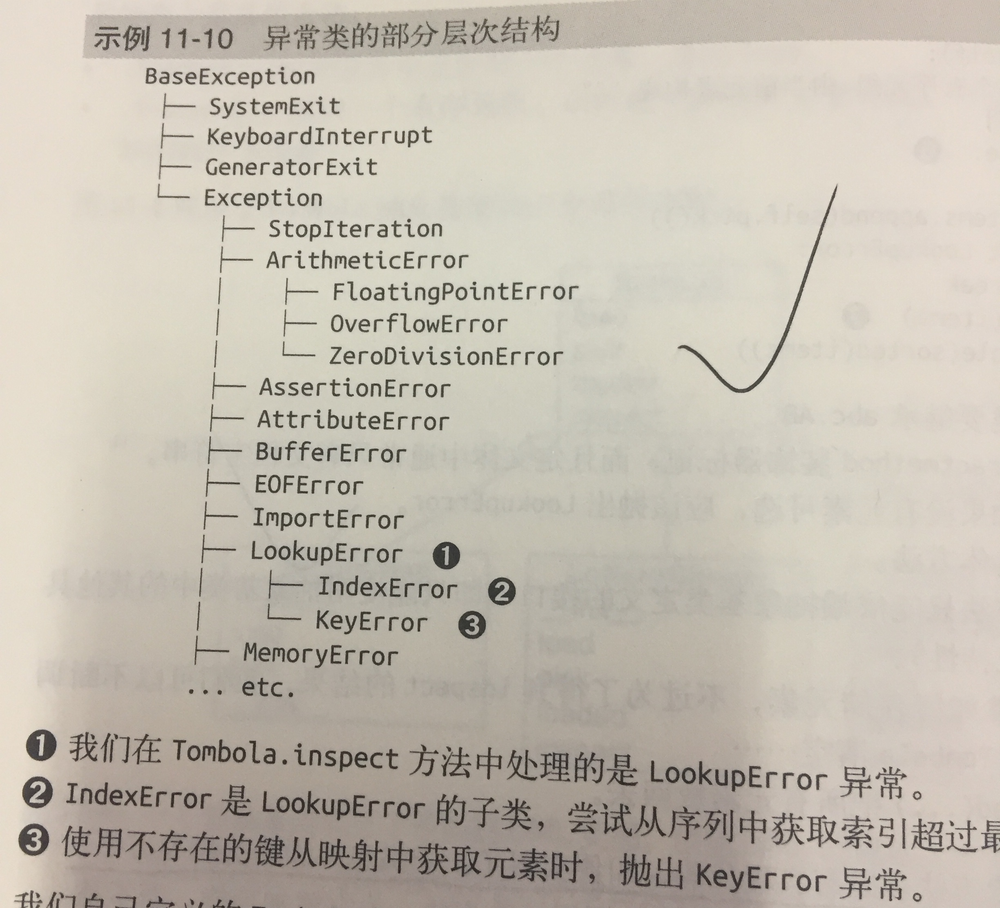

### 11.7 定义并使用一个抽象基类
```
import abc

class Tombola(abc.ABC):

    @abc.abstractmethod
    def load(self, iterable):
        ''' 从可迭代对象添加元素 '''

    @abc.abstractmethod
    def pick(self):
        ''' 随机删除元素，然后将其返回， 如果实例为空，抛出 LookUpError  '''

    def loaded(self):
        return bool(self.inspect())

    def inspect(self):
        ''' 如果至少有一个元素，返回True， 否则返回False'''
        items = []
        while True:
            try:
                items.append(self.pick())
            except LookupError:
                break
        self.load(items)
        return tuple(sorted(items))
```
* 几点说明：
1. 自定义抽象类要继承 abc.ABC
2. 抽象方法使用 @abstractmethod装饰器标记，而且定义体中通常只有文档字符串。
3. 抽象基类可以包含具体方法
4. 抽象基类中的具体方法只能依赖于抽象基类定义的接口，（只能使用抽象基类中的其他具体方法，抽象方法和特性）

* 其实，抽象方法可以有实现代码，即便实现了，子类也必须覆盖抽象方法，但是子类中可以使用super()函数调用抽象方法，
为它添加功能。而不是从头开始实现。



```
class MyAVC(abc.ABC):
    @classmethod
    @abc.abstractmethod
    def an_abstrct_classmethod(cs, ...):
        pass
```
* 与其他方法描述符一起使用时， abstractmethod应该放在最里面。