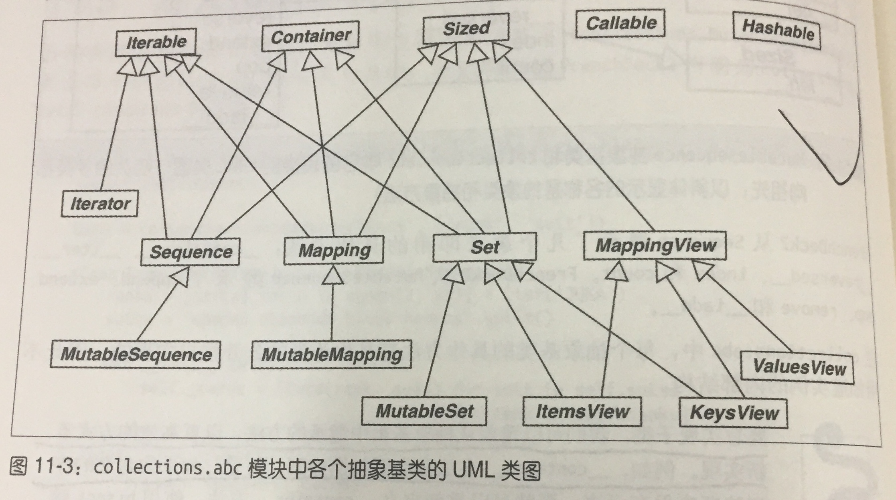
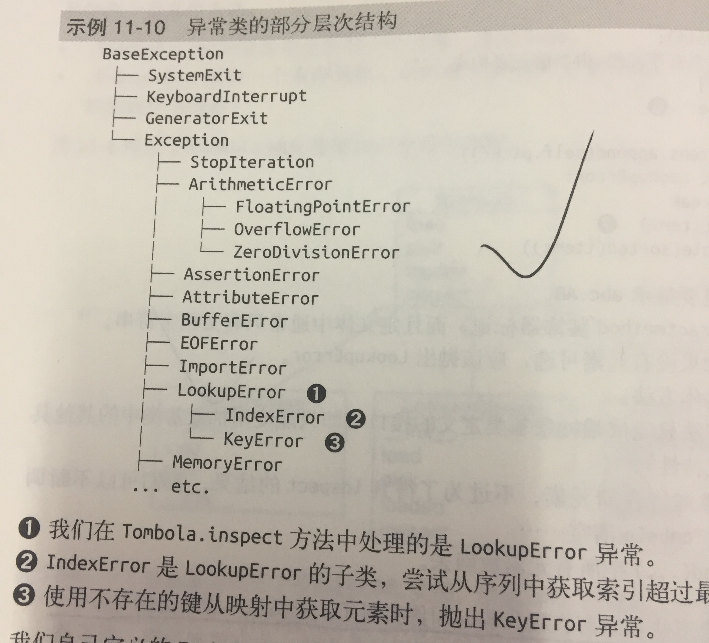

### 11.1 python文化中的接口和协议

* 每个类都有接口：类实现或继承的公开属性，包括特殊方法，如 `__getitem__`或 `__add__`
* 接口补充定义：对象公开方法的子集，让对象在系统中扮演特定的角色，接口是实现特定角色的方法集合，协议与继承
没有关系，一个类可能实现多个接口，从而让实例扮演多个角色。
* 协议是接口，但不是正式的（只由文档和约定定义），因此协议不能像正式接口那样施加限制，一个可能只实现不部分接口。



### 11.2 python喜欢序列

* python数据模型的哲学是尽可能支持基础协议。



### 11.3 使用猴子补丁在运行时实现协议
```
def set_cart(deck, posiontion, card):
    deck._cards[position] = card
FrenchDeck.__setitem__ = set_card 绑定方法
```



### 11.4 Alex Martelli的水禽
 
 * 鸭子类型：忽略对象的真正类型，转而关注对象有没有实现所需要的方法，签名和语义。
 
 
 ### 11.5 定义抽象基类的子类
 
 * 要想实现子类，我们可以覆盖从抽象基类中继承的方法，以高效的方式重新实现，例如，`__contains__`方法会全面扫描序列，
可是，如果你定义的序列按顺序保存元素，那就可以重新定义 `__contains__`方法，使用bisecth函数做二分查找，从而提升搜索素的。



### 11.6 标准库中的抽象基类



* Iterable、Container和Sized: \
各个集合应该继承这三个抽象类，或者至少实现兼容的协议，Iterable通过 `__iter__`方法支持迭代，\
Container 通过 `__contains__`方法支持in运算符， \
Sized 通过 `__len__`方法支持 len()

* Sequence, Mapping， Set： \
这三个主要的不可变集合类型，而且各自都有可变的子类，

* MappingView: \
映射方法.items, keys(), .values() 返回的对象分别是 ItemView,KeysView, ValueView实例，前两个类还从set类继承了丰富的接口。

* Casllable, Hashable：


### 11.7 定义并使用一个抽象基类
```
import abc

class Tombola(abc.ABC):

    @abc.abstractmethod
    def load(self, iterable):
        ''' 从可迭代对象添加元素 '''

    @abc.abstractmethod
    def pick(self):
        ''' 随机删除元素，然后将其返回， 如果实例为空，抛出 LookUpError  '''

    def loaded(self):
        return bool(self.inspect())

    def inspect(self):
        ''' 如果至少有一个元素，返回True， 否则返回False'''
        items = []
        while True:
            try:
                items.append(self.pick())
            except LookupError:
                break
        self.load(items)
        return tuple(sorted(items))
```
* 几点说明：
1. 自定义抽象类要继承 abc.ABC
2. 抽象方法使用 @abstractmethod装饰器标记，而且定义体中通常只有文档字符串。
3. 抽象基类可以包含具体方法
4. 抽象基类中的具体方法只能依赖于抽象基类定义的接口，（只能使用抽象基类中的其他具体方法，抽象方法和特性）

* 其实，抽象方法可以有实现代码，即便实现了，子类也必须覆盖抽象方法，但是子类中可以使用super()函数调用抽象方法，
为它添加功能。而不是从头开始实现。



```
class MyAVC(abc.ABC):
    @classmethod
    @abc.abstractmethod
    def an_abstrct_classmethod(cs, ...):
        pass
```
* 与其他方法描述符一起使用时， abstractmethod应该放在最里面。

#### 虚拟子类

* 即便不继承，也有办法把一个类注册为抽象基类的虚拟子类。
* 注册虚拟子类的方法是在抽象基类上调用 register方法，这么做之后，注册的类会变成抽象基类的虚拟子类，
而且 issubclass和isinstance等函数都能识别，但是注册的类不会从抽象子类继承任何方法或属性。

```
@Tombola.register
class TombolaList(list):
    
    def pick(self):
        if self:
            position = randrange(len(self))
            return self.pop(position)
        else:
            raise LookupError('pop from empty Tombolist')
    
    load = list.extend
    
    def loaded(self):
        return bool(self)
    def inspect(self):
        return tuple(sorted(self))
```
* 类继承关系在一个特殊的类属性中指定， `__mro__`，方法解析顺序，这个属性的作用很简单，按顺序列出类及其超类，
python会按照这个顺序搜索方法，
```
>>> TomboList.__mro__
(<class 'tombolist.TomboList'>, <class 'list'>, <class 'object'>)
```
* TomboList.__mro__中没有Tombola,因此TomboList没有从Tombo中继承任何方法。


### 11.8 Tombola子类的测试方法

* 没看


### 11.9 python使用register方法


### 11.10 鹅的行为有可能像鸭子

```
class Sized(metaclass=ABCMeta):
    
    __slots__ = ()
    
    @abstractmethod
    def __len__(self):
        return 0
    
    @classmethod
    def __subclasshook__(cls, C):
        if cls is Sized:
            if any("__len__" in B._-dict__ for B in C.__mro__)
                return True
         return NOtImplement
```