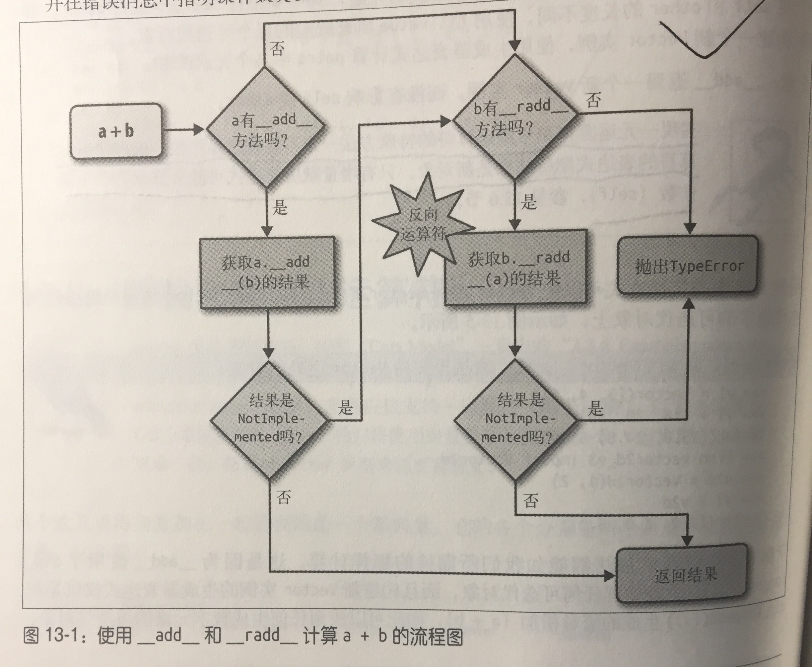




### 13.3 重载向量加法运算符+

* 实现一元运算符和中缀运算符的特殊方法一定不能修改操作数，使用这些运算符的表达式期待结果是新对象，
只有增量赋值表达式可能修改第一个操作数。



* `__radd__`是 `__add__`的反射版本或者反向版本。
* 别把NotImplemented和NotImplementedError搞混了。前者是特殊的单例值，如果中缀运算符特殊方法不能处理给定的操作数，
那么要把它返回给解释器。而NotImplementError是一种异常，抽象类中的站位方法把它抛出，提醒子类必须覆盖。
* 如果由于类型不兼容而导致运算符特殊方法无法返回有效的结果，那么应该返回NotImplemented，而不是抛出TypeError。
返回NotImplemented，另一个操作数所属的类型还有机会执行运算，即python的反向调用。
* 为了遵守鸭子类型精神，我们不能测试other操作数的类型，或者它的元素的类型，我们要捕获异常，然后返回NotImplemented。
如果解释器还未反转操作数，那么它将尝试去做，如果反向方法返回NotImplement，那么python抛出TypeError。
```
def __add__(self, other):
    try:
        pairs = itertools.zip_longest(self, other, fillvalue=0.0)
        return Vector(a + b for a, b in pairs)
    except TypeError:
        return NotImplemented
def __radd__(self, other):
    return self + other
```
* 如果中缀运算符方法抛出异常，就终止了运算符分派机制，对TypeError来说，通常最好讲其捕获，然后返回NotImplemented，这样，
解释器会尝试调用反向运算符方法，如果操作数是不同的类型，对调之后，反向运算符方法可能会正确计算。

