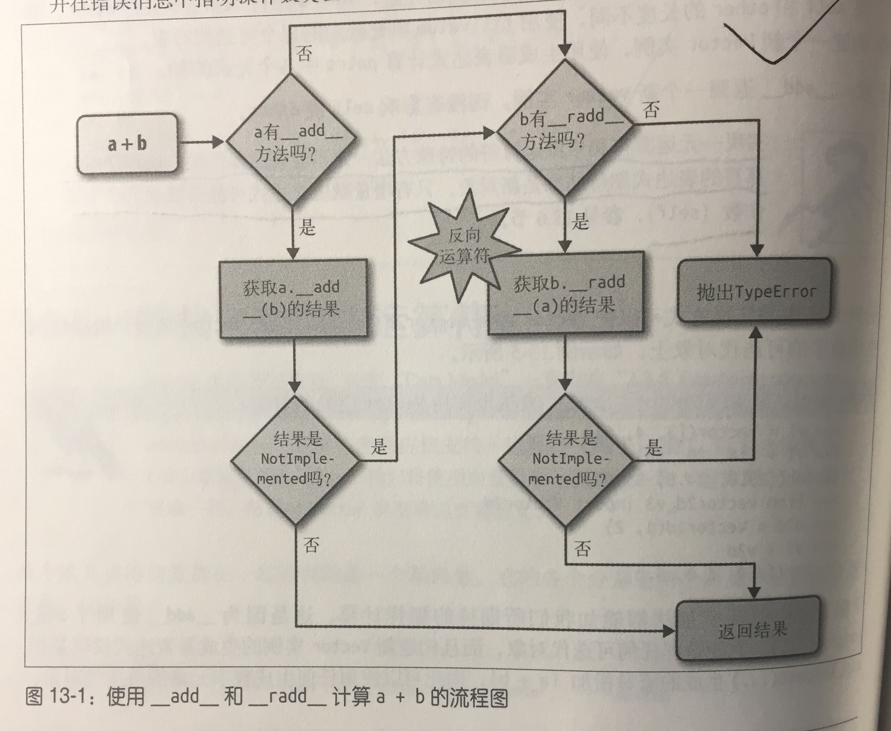
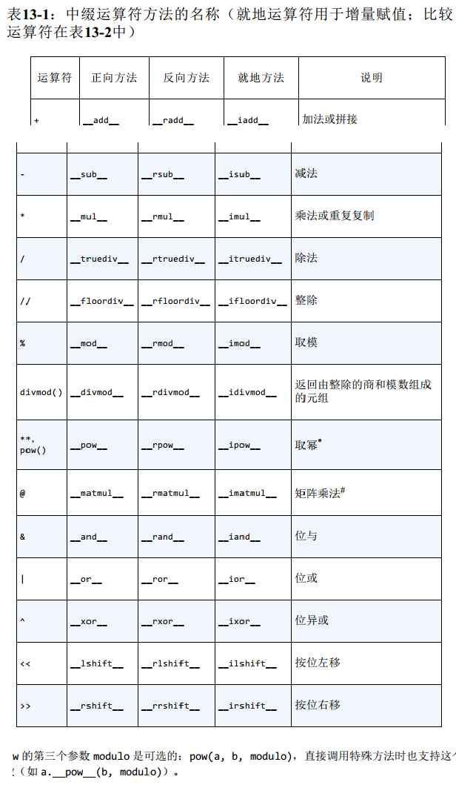
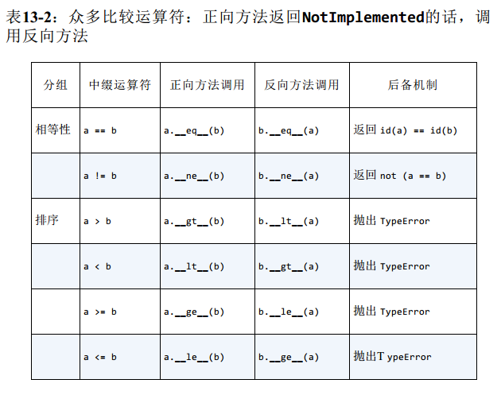

* 我们将讨论内容
1. python如何处理中缀运算符中不同类型的操作数。
2. 使用鸭子类型或显示类型检查处理不同类型的操作数。
3. 中缀运算符如何表明自己无法处理操作数。
4. 众多比较运算符的特殊行为。
5. 增量赋值运算符的默认处理方式和重载方式。


### 13.1 运算符重载基础

* python施加了一些限制，做好了灵活性、可用性和安全性方面的平衡：
1. 不能重载内置类型的运算符；
2. 不能新建运算符，只能重载现有的；
3. 某些运算符不能重载，-is,and,or, not（不过为运算符 & | ~可以）


### 13.2 一元运算符

* - (`__neg__`)：一元取负运算符
* + (`__pos__`): 一元取正算术运算符。
* ~(`__invert__`)：对整数按位取反，定义为 ~x = -(x + 1)
> 要遵循运算符的一个基本原则：始终返回一个新对象，也就是说，不能修改self，要创建并返回合适类型的新实例。

```
x 和 +x何时不相等：
1. x所在的上下文使用个某个精度，而计算+x的时候，精度变了。
2. collections.Counter类实现了运算符+，当两个Counter相加时，负值和零值计数从结果中被剔除，
而一元运算符+，相当于加上一个空Counter，因此产生了一个新的Counter且仅保留了大于零的计数器。
>>> ct = Counter("abracadabra")
>>> ct
Counter({'a':5, 'r':2, 'b':2, 'd': 1, 'c': 1})
>>> ct['r'] = -3
>>> ct['d'] = 0
>>> ct
Counter({'a':5, 'r':-3, 'b':2, 'd': 0, 'c': 1})
>>> +ct
Counter({'a':5, 'b':2, 'c': 1})
```


### 13.3 重载向量加法运算符+

* 实现一元运算符和中缀运算符的特殊方法一定不能修改操作数，使用这些运算符的表达式期待结果是新对象，
只有增量赋值表达式可能修改第一个操作数。



* `__radd__`是 `__add__`的反射版本或者反向版本。
* 别把NotImplemented和NotImplementedError搞混了。前者是特殊的单例值，如果中缀运算符特殊方法不能处理给定的操作数，
那么要把它返回给解释器。而NotImplementError是一种异常，抽象类中的站位方法把它抛出，提醒子类必须覆盖。
* 如果由于类型不兼容而导致运算符特殊方法无法返回有效的结果，那么应该返回NotImplemented，而不是抛出TypeError。
返回NotImplemented，另一个操作数所属的类型还有机会执行运算，即python的反向调用。
* 为了遵守鸭子类型精神，我们不能测试other操作数的类型，或者它的元素的类型，我们要捕获异常，然后返回NotImplemented。
如果解释器还未反转操作数，那么它将尝试去做，如果反向方法返回NotImplement，那么python抛出TypeError。
```
def __add__(self, other):
    try:
        pairs = itertools.zip_longest(self, other, fillvalue=0.0)
        return Vector(a + b for a, b in pairs)
    except TypeError:
        return NotImplemented
def __radd__(self, other):
    return self + other
```
* 如果中缀运算符方法抛出异常，就终止了运算符分派机制，对TypeError来说，通常最好讲其捕获，然后返回NotImplemented，这样，
解释器会尝试调用反向运算符方法，如果操作数是不同的类型，对调之后，反向运算符方法可能会正确计算。


### 13.4 重载标量乘法运算符 *




### 13.5 众多比较运算符

* python解释器对众多比较运算符（==, !=, >, < ,>= ,<=）的处理与前面类似，不过在两个方面有重大区别：
1. 正向和方向调用使用的是同一系列方法，
2. 对 == 和 !=来说，如果方向调用失败了，python会比较对象的ID，而不是抛出TypeError




### 13.6 增量赋值运算符

* 增量赋值不会修改不可变目标，而是新建实例，然后重新绑定。
* 如果类没有实现就地运算符，增量运算符知识语法糖， a += b和 a=a+b完全一样。对不可变类型来说，这是预期的行为，而且，如果
定义了 `__add__`方法的话，不用编写额外的代码实现, +=就能使用。
* 然而如果实现了就地运算符方法，它们就会修改做操作数，而不是创建新对象作为结果。
* 不可变类型，一定不能实现就地特殊方法，这是明显的事实，不过还是值得提出来。

> 通过观察内置的list类型的工作方式，我确定了要对+和+=的行为做了限制，My_list+x只能用于两个列表加到一起，
my_list+=x可以使用右边可迭代对象x中的元素扩展左边的列表，list.extend()的行为也是这样的，它的参数可以是任何可迭代对象。


### 本章小结

* python对运算符重载施加了一些限制，禁止重载内置类型的运算符，而且限于重载现有的运算符，不过有几个例外。
* 
