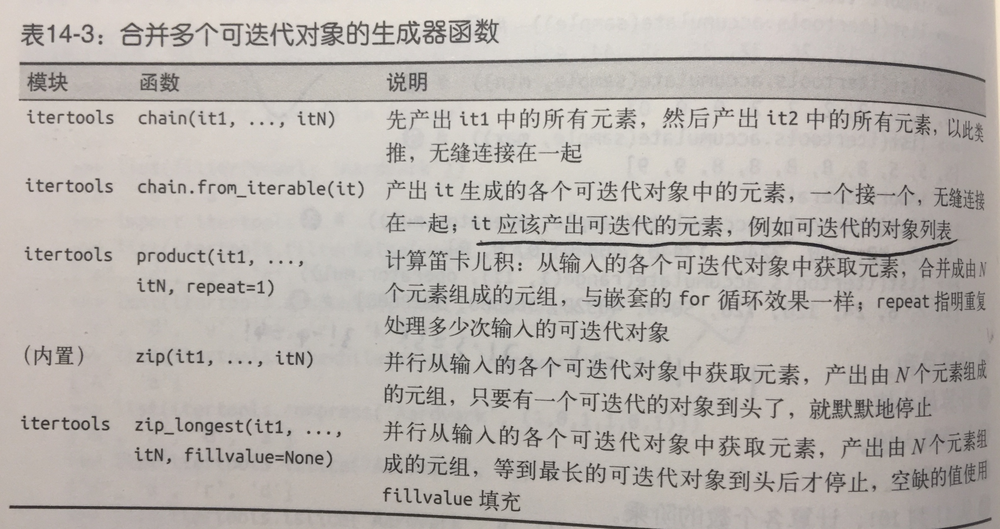



#### 接下来一组是用于合并的生成器函数，这些函数都从输入的多个迭代对象中产生元素。



```
>>> list(itertools.chain('ABC', range(2))) # ➊
['A', 'B', 'C', 0, 1]
>>> list(itertools.chain(enumerate('ABC'))) # ➋
[(0, 'A'), (1, 'B'), (2, 'C')]
>>> list(itertools.chain.from_iterable(enumerate('ABC'))) # ➌
[0, 'A', 1, 'B', 2, 'C']
>>> list(zip('ABC', range(5))) # ➍
[('A', 0), ('B', 1), ('C', 2)]
>>> list(zip('ABC', range(5), [10, 20, 30, 40])) # ➎
[('A', 0, 10), ('B', 1, 20), ('C', 2, 30)]
>>> list(itertools.zip_longest('ABC', range(5))) # ➏
[('A', 0), ('B', 1), ('C', 2), (None, 3), (None, 4)]
>>> list(itertools.zip_longest('ABC', range(5), fillvalue='?')) # ➐
[('A', 0), ('B', 1), ('C', 2), ('?', 3), ('?', 4)]
```
* chain.from_iterable函数从可迭代的对象中获取每个元素。然后按顺序把元素连接起来，前提是各个元素本身也是可迭代的对象。

