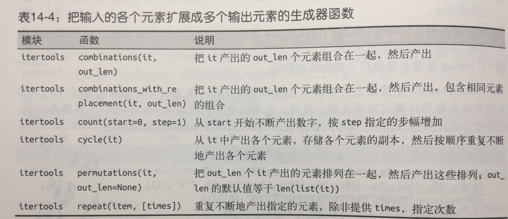


#### 把输入扩展成多个输出


* 演示 count、 repeat 和 cycle 的用法
```
>>> ct = itertools.count() # ➊
>>> next(ct) # ➋
0>
>> next(ct), next(ct), next(ct) # ➌
(1, 2, 3)
>>> list(itertools.islice(itertools.count(1, .3), 3)) # ➍
[1, 1.3, 1.6]
>>> cy = itertools.cycle('ABC') # ➎
>>> next(cy)
'A'
>>> list(itertools.islice(cy, 7)) # ➏
['B', 'C', 'A', 'B', 'C', 'A', 'B']
>>> rp = itertools.repeat(7) # ➐
>>> next(rp), next(rp)
(7, 7)
>>> list(itertools.repeat(8, 4)) # ➑
[8, 8, 8, 8]
>>> list(map(operator.mul, range(11), itertools.repeat(5))) # ➒
[0, 5, 10, 15, 20, 25, 30, 35, 40, 45, 50]
```
* combinations,combinations_with_replacement和permutations生成器函数，连通product函数，成为组合学生成器，
```
>>> list(itertools.combinations('ABC', 2)) # ➊
[('A', 'B'), ('A', 'C'), ('B', 'C')]
>>> list(itertools.combinations_with_replacement('ABC', 2)) # ➋
[('A', 'A'), ('A', 'B'), ('A', 'C'), ('B', 'B'), ('B', 'C'), ('C', 'C')]
>>> list(itertools.permutations('ABC', 2)) # ➌
[('A', 'B'), ('A', 'C'), ('B', 'A'), ('B', 'C'), ('C', 'A'), ('C', 'B')]
>>> list(itertools.product('ABC', repeat=2)) # ➍
[('A', 'A'), ('A', 'B'), ('A', 'C'), ('B', 'A'), ('B', 'B'), ('B', 'C'),
('C', 'A'), ('C', 'B'), ('C', 'C')]
```