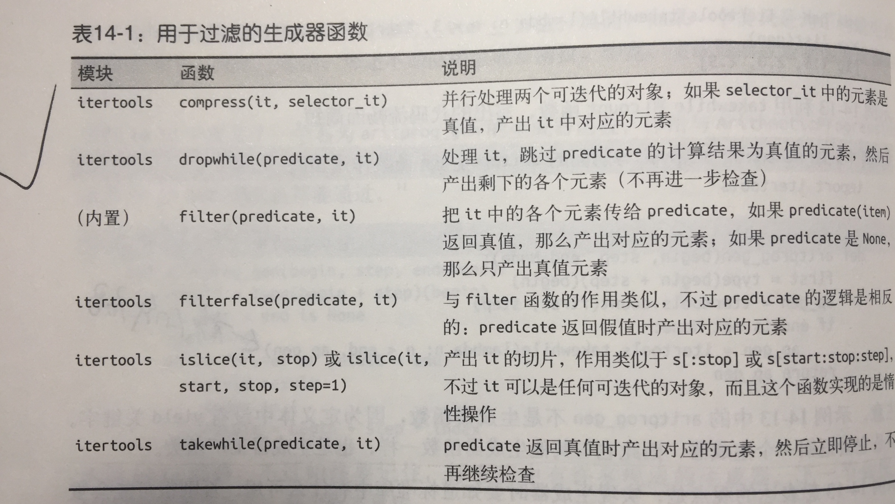
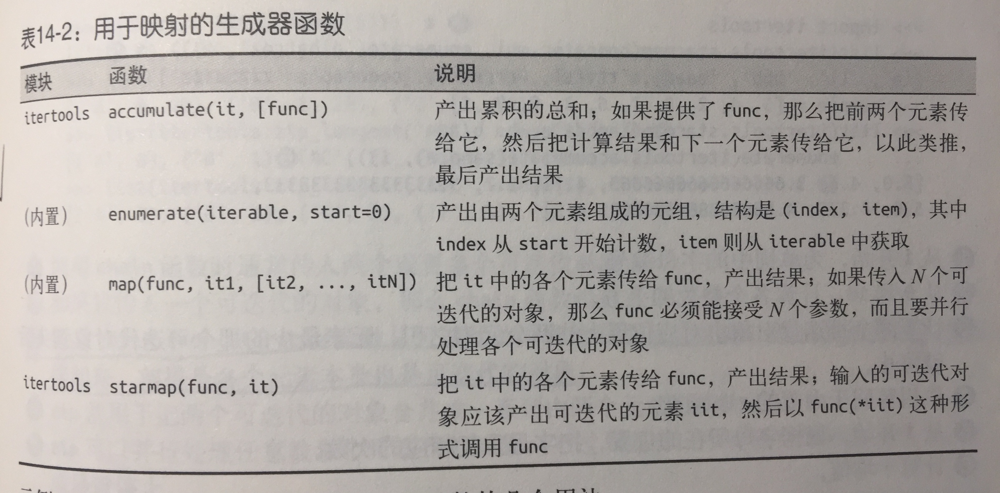
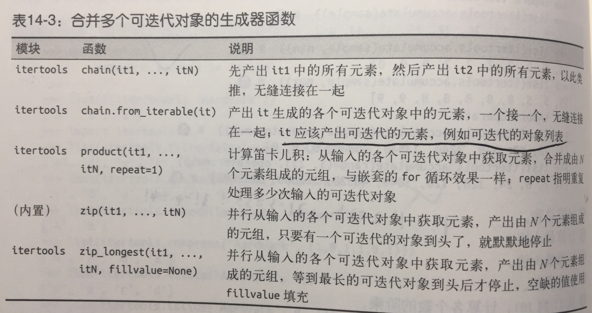
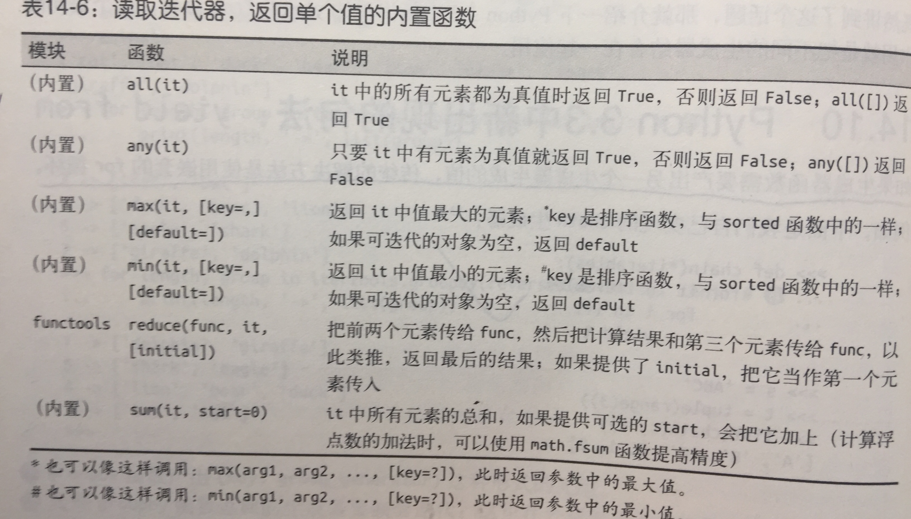
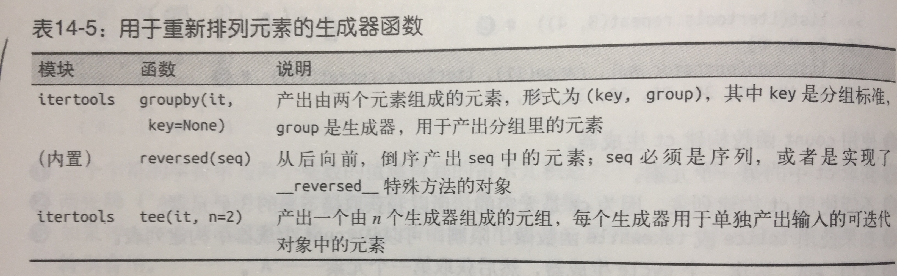

* 迭代是数据处理的基石，扫描内存中放不下的数据集时，我们要找到一种惰性获得数据项的方式，按需一次获取一个数据项。
这就是迭代器模式。
* 所有生成器都是迭代器，因为生成器完全实现了迭代器接口。
* python中，所有集合都是可迭代的，在python语言内部，迭代器用于支持
    * for循环
    * 构建和扩展集合类型
    * 逐行遍历文本文件
    * 列表推导、字典推导和集合推导
    * 元组拆包
    * 调用函数时，使用*拆包实参
* 本章涵盖一下话题
    * 语言内部使用iter(...)内置函数处理可迭代对象的方式
    * 如何使用python实现经典的迭代器模式
    * 详细说明生成器函数的工作原理
    * 如何使用生成器函数或生成器表达式替代经典的迭代器
    * 如何使用标准库中通用的生成器函数
    * 如何使用 yield from语句合并生成器
    * 为什么生成器和协程看似相同，实则差别很大，不能混淆



### 14.1 单词序列

* 序列可迭代的原因：iter函数
    * 检查对象是否实现了 `__iter__`方法，如果实现了就调用它，获得一个迭代器
    * 如果没有实现 `__iter__`方法，但是实现了 `__getitem__`方法，python会创建一个迭代器，尝试顺序获取元素
    * 如果尝试失败，python抛出TypeError异常，通常会提示 “C object is not iterable”
* 从python 3.4 开始，检查对象x能否迭代，最准确的方法是，调用iter（x）函数，如果不可迭代，再处理TypeError异常，这比使用
isinstance(x, abc.Iterable)更准确，因为iter(x)函数会考虑到遗留的 `__getitem__`方法，而abc.Iterable类则不考虑。


### 14.2 可迭代的对象与迭代器对比

* 可迭代对象： 使用iter内置函数可以获取迭代器的对象，如果对象实现了能返回迭代器的 `__iter__`方法，那么对象就是可迭代的，
序列都可以迭代，实现了 `__getitem__`方法，而且其参数是从零开始的索引，这种对象也可以迭代。
* 我们要明确课迭代对象和迭代器之间的关系：python从可迭代对象中获取迭代器。
* 标准迭代器接口有两个方法：
    1. `__next__`:返回下一个可用元素，如果没有元素了，抛出 stopIteration异常
    2. `__iter__`：返回self，以便于应该使用可迭代对象的地方使用迭代器，例如for循环。
* python3中，Iterator抽象基类定义了抽象方法的`it.__next__()`，而在python2中使用it.next()方法，一如既往，我们应该
避免直接调用特殊方法，使用next(it)即可。
* 迭代器：迭代器是这样的对象，实现了无参数的 `__next__`方法，返回序列中的下一个元素，如果没有元素了，那么抛出StopIteration
异常。


### 14.3 典型的迭代器

```
RE_WORD = re.compile('\w+')

class Sentence:
    def __init__(self, text):
        self.text = text
        self.words = RE_WORD.findall(text)
        pass
    def __repr__(self):
        return 'Sentence{}'.format(reprlib.repr(self.text))
    def __iter__(self):
        return SentenceIterator()

class SentenceIterator:
    def __init__(self, words):
        self.words = words
        self.index = 0
    def __next__(self):
        try:
            word = self.words[self.index]
        except IndexError:
            raise StopIteration()
        self.index += 1
        return word
    def __iter__(self):
        return self
```
* 把Sentence编程迭代器：坏主意
* 构建可迭代对象和迭代器时常会出现错误，原因是混淆了二者，要知道，可迭代的对象有个 `__iter__`方法，
每次都实例化一个新的迭代器，而迭代器要实现 `__next__`方法，返回单个元素，此外还要实现 `__iter__`方法，
返回迭代器本身。因此，迭代器可以迭代，但是可迭代对象不是迭代器。
* 迭代器模式可用来
    * 访问一个聚合对象的内容而无需暴露它的内部表示
    * 支持对聚合对象的多种遍历
    * 为遍历不同的聚合结构提供一个统一的接口（支持多态迭代）
* 可迭代的对象一定不能是自身的迭代器，也就是说，可迭代器的对象必须实现 `__iter))`方法，但不能实现 `__next__`方法，另一方面，
迭代器应该一直可以迭代，迭代器的 `__iter__`方法应该返回自身。



### 14.4 生成器函数

* 使用生成器函数实现
```
RE_WORD = re.compile('\w+')

class Sentence:
    def __init__(self, text):
        self.text = text
        self.words = RE_WORD.findall(text)
        pass
    def __repr__(self):
        return 'Sentence{}'.format(reprlib.repr(self.text))
    def __iter__(self):
        for word in self.words:
            yield word
        return 
```
#### 生成器函数的工作原理
只要python函数的定义体中有yield关键字，该函数就是一个生成器。调用生成器函数时，会返回一个生成器对象，也就是说，
生成器函数一个生成器工厂。


### 14.5 惰性实现
```
RE_WORD = re.compile('\w+')

class Sentence:
    def __init__(self, text):
        self.text = text
        pass
    def __repr__(self):
        return 'Sentence{}'.format(reprlib.repr(self.text))
    def __iter__(self):
        for match in RE_WORD.finditer(self.text):
            yield match.group()  # 返回MatchObject实例中提取匹配正则表达式的具体文本。
```



### 14.6 生成器表达式

* 简单的生成器函数，可以替换成生成器表达式
* 生成器表达式可以理解为列表推导的惰性版本：不会迫切地构建列表，而是返回一个生成器，按需惰性生成元素。也就是说，
如果列表推导是一个制造列表的工厂，那么生成器表达式就是制造生成器的工厂。
```
res = [x * 3 for x in gen_AB()]   # 列表推导， res是一个列表
res = (x * 3 for x in gen_AB())   # 生成器表达式， res是一个生成器
```
* 列表推导迫切地迭代gen_AB()函数生成的生成器对象产生出的元素，
* 把生成器表达式返回的值赋值给res，只需调用gen_ab函数，虽然调用时会返回一个生成器，但这里并不使用。
* 只有for循环迭代res时，gen_ab函数的定义体才会真正执行，for循环每次迭代时会隐式调用next(res)，前进到gen_ab函数中的下一个
yield语句，注意gen_ab函数的输出与for循环中print函数的输出夹杂在一起。
* 生成器表达式是语法糖，完全可以替换成生成器函数，不过有时使用生成器表达式更便利。


### 14.7 何时使用生成器表达式

* 根据我的经验，选择使用哪种句法很容易判断，如果生成器表达式要分成多行写，我倾向于定义生成函数，以便于提高可读性，此外，
生成器函数有名称，可以重用。


### 14.8 另一个示例：等差数列生成器

* 典型的迭代器模式作用很简单，遍历数据结构。


### 14.9 标准库中的生成器函数

* 通用的函数，参数为任意的可迭代对象，返回值为生成器，用于生成选中过的，计算出来的，重新排列的元素。

#### 第一组是用于过滤的生成器函数，从输入的可迭代对象中产生元素的子集，而且不修改元素本身。



```
>>> def vowel(c):
... return c.lower() in 'aeiou'
...
>>> list(filter(vowel, 'Aardvark'))
['A', 'a', 'a']
>>> import itertools
>>> list(itertools.filterfalse(vowel, 'Aardvark'))
['r', 'd', 'v', 'r', 'k']
>>> list(itertools.dropwhile(vowel, 'Aardvark'))
['r', 'd', 'v', 'a', 'r', 'k']
>>> list(itertools.takewhile(vowel, 'Aardvark'))
['A', 'a']
>>> list(itertools.compress('Aardvark', (1,0,1,1,0,1)))
['A', 'r', 'd', 'a']
>>> list(itertools.islice('Aardvark', 4))
['A', 'a', 'r', 'd']
>>> list(itertools.islice('Aardvark', 4, 7))
['v', 'a', 'r']
>>> list(itertools.islice('Aardvark', 1, 7, 2))
['a', 'd', 'a']
```

#### 下一组是用于映射的生成器函数，在输入的单个可迭代对象中的各个元素上做计算，然后返回结果。



* 演示 itertools.accmulate生成器函数
```
>>> sample = [5, 4, 2, 8, 7, 6, 3, 0, 9, 1]
>>> import itertools
>>> list(itertools.accumulate(sample)) # 计算总和
[5, 9, 11, 19, 26, 32, 35, 35, 44, 45]
12
12
>>> list(itertools.accumulate(sample, min)) # 计算最小值
[5, 4, 2, 2, 2, 2, 2, 0, 0, 0]
>>> list(itertools.accumulate(sample, max)) # 计算最大值
[5, 5, 5, 8, 8, 8, 8, 8, 9, 9]
>>> import operator
>>> list(itertools.accumulate(sample, operator.mul)) # 计算乘积
[5, 20, 40, 320, 2240, 13440, 40320, 0, 0, 0]
>>> list(itertools.accumulate(range(1, 11), operator.mul))  # 从1！到10！，计算各个数的阶乘
[1, 2, 6, 24, 120, 720, 5040, 40320, 362880, 3628800] 
```
* 演示用于映射的生成器函数
```
>>> list(enumerate('albatroz', 1)) # 
[(1, 'a'), (2, 'l'), (3, 'b'), (4, 'a'), (5, 't'), (6, 'r'), (7, 'o'), (8, 'z')]
>>> import operator
>>> list(map(operator.mul, range(11), range(11))) # 
[0, 1, 4, 9, 16, 25, 36, 49, 64, 81, 100]
>>> list(map(operator.mul, range(11), [2, 4, 8])) # 
[0, 4, 16]
>>> list(map(lambda a, b: (a, b), range(11), [2, 4, 8])) # 
[(0, 2), (1, 4), (2, 8)]
>>> import itertools
>>> list(itertools.starmap(operator.mul, enumerate('albatroz', 1))) # 
['a', 'll', 'bbb', 'aaaa', 'ttttt', 'rrrrrr', 'ooooooo', 'zzzzzzzz']
>>> sample = [5, 4, 2, 8, 7, 6, 3, 0, 9, 1]
>>> list(itertools.starmap(lambda a, b: b/a,
... enumerate(itertools.accumulate(sample), 1))) # 
[5.0, 4.5, 3.6666666666666665, 4.75, 5.2, 5.333333333333333,
5.0, 4.375, 4.888888888888889, 4.5]
```

#### 接下来一组是用于合并的生成器函数，这些函数都从输入的多个迭代对象中产生元素。



```
>>> list(itertools.chain('ABC', range(2))) # ➊
['A', 'B', 'C', 0, 1]
>>> list(itertools.chain(enumerate('ABC'))) # ➋
[(0, 'A'), (1, 'B'), (2, 'C')]
>>> list(itertools.chain.from_iterable(enumerate('ABC'))) # ➌
[0, 'A', 1, 'B', 2, 'C']
>>> list(zip('ABC', range(5))) # ➍
[('A', 0), ('B', 1), ('C', 2)]
>>> list(zip('ABC', range(5), [10, 20, 30, 40])) # ➎
[('A', 0, 10), ('B', 1, 20), ('C', 2, 30)]
>>> list(itertools.zip_longest('ABC', range(5))) # ➏
[('A', 0), ('B', 1), ('C', 2), (None, 3), (None, 4)]
>>> list(itertools.zip_longest('ABC', range(5), fillvalue='?')) # ➐
[('A', 0), ('B', 1), ('C', 2), ('?', 3), ('?', 4)]
```
* chain.from_iterable函数从可迭代的对象中获取每个元素。然后按顺序把元素连接起来，前提是各个元素本身也是可迭代的对象。


#### 把输入扩展成多个输出


* 演示 count、 repeat 和 cycle 的用法
```
>>> ct = itertools.count() # ➊
>>> next(ct) # ➋
0>
>> next(ct), next(ct), next(ct) # ➌
(1, 2, 3)
>>> list(itertools.islice(itertools.count(1, .3), 3)) # ➍
[1, 1.3, 1.6]
>>> cy = itertools.cycle('ABC') # ➎
>>> next(cy)
'A'
>>> list(itertools.islice(cy, 7)) # ➏
['B', 'C', 'A', 'B', 'C', 'A', 'B']
>>> rp = itertools.repeat(7) # ➐
>>> next(rp), next(rp)
(7, 7)
>>> list(itertools.repeat(8, 4)) # ➑
[8, 8, 8, 8]
>>> list(map(operator.mul, range(11), itertools.repeat(5))) # ➒
[0, 5, 10, 15, 20, 25, 30, 35, 40, 45, 50]
```
* combinations,combinations_with_replacement和permutations生成器函数，连通product函数，成为组合学生成器，
```
>>> list(itertools.combinations('ABC', 2)) # ➊
[('A', 'B'), ('A', 'C'), ('B', 'C')]
>>> list(itertools.combinations_with_replacement('ABC', 2)) # ➋
[('A', 'A'), ('A', 'B'), ('A', 'C'), ('B', 'B'), ('B', 'C'), ('C', 'C')]
>>> list(itertools.permutations('ABC', 2)) # ➌
[('A', 'B'), ('A', 'C'), ('B', 'A'), ('B', 'C'), ('C', 'A'), ('C', 'B')]
>>> list(itertools.product('ABC', repeat=2)) # ➍
[('A', 'A'), ('A', 'B'), ('A', 'C'), ('B', 'A'), ('B', 'B'), ('B', 'C'),
('C', 'A'), ('C', 'B'), ('C', 'C')]
```

#### 最后一组生成器函数用于产生输入的可迭代对象中的全部元素，不过会以某种方式重新排列。






### 14.10 yield from

```
>>> def chain(*iterables):
... for it in iterables:
...     for i in it:
...         yield i
...
>>> s = 'ABC'
>>> t = tuple(range(3))
>>> list(chain(s, t))
['A', 'B', 'C', 0, 1, 2]
```
* 简化版
```
>>> def chain(*iterables):
... for i in iterables:
... yield from i
...
>>> list(chain(s, t))
['A', 'B', 'C', 0, 1, 2]
```



### 14.11 可迭代的归约函数

* 函数接受一个可迭代对象，然后返回单个结果。这些函数成为归约函数。




### 14.12 深入分析iter函数

* iter函数还有一个鲜为人知的用法：传入两个参数，使用常规的函数或任何可调用对象创建迭代器，这样使用时，第一个参数必须是
可调用的对象，用于不断调用，产生各个值，第二值是哨兵，这是个标记值，当可调用对象返回这个值得时候，出发迭代器抛出
StopIterator异常，而不产生哨兵。
```
>>> def d6():
... return randint(1, 6)
...
>>> d6_iter = iter(d6, 1)
>>> d6_iter
<callable_iterator object at 0x00000000029BE6A0>
>>> for roll in d6_iter:
... print(roll)
...
4363
```


### 14.14 把生成器当成协程

* 与 `__next__`方法一样，`send`方法致使生成器前进到下一个yield语句，不过，send方法还允许使用生成器的客户把数据发给自己，
即不管传给send方法的参数，那个参数都会成为生成器函数定义体中对应的yield表达式的值。
* 生成器用于生成供迭代的数据
* 协程是数据的消费者
* 协程与迭代无关，


### 杂谈

* 在设计不同目的的控制和显示设备时，设计师需要确认它们之间具有明显差异。
* 简单的示例
```
def f(): x=0
    while True:
        x += 1
        yield x
```
```
def f():
    def do_yield(n):
        yield n
    x = 0
    while True:
        x += 1
        do_yield(x)
```
* 上面写法会先入无限循环，而不是生成器，因为yield关键字只能把最近的外层函数变成生成器函数，虽然生成器函数看起来像函数，
可是我们不能通过简单的函数调用把职责委托给另一个生成器。
* 下面写法合理
```
def f():
def do_yield(n):
yield n
x = 0
while True:
x += 1
yield from do_yield(x)  # 从生成器读取
```