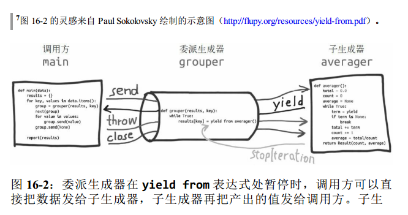

### 16.7 使用yield from

* yield from的主要功能是打开双向通道，把最外层的调用方与最内层的子生成器连接起来，这样二者可以直接发送和产出值，
还可以直接传入异常，而不是在位于中间的协程中添加大量处理异常的样本代码。
* 委派生成器： 包含yield from <iterable>表达式的生成函数。
* 子生成器：从yield from表达式中<iterable>部分获取的生成器
* 调用方



```
from collections import namedtuple
Result = namedtuple('Result', 'count average')

# 子生成器
def averager(): ➊
    total = 0.0
    count = 0
    average = None
    while True:
        term = yield ➋
        if term is None: ➌
        break
        total += term
        count += 1
        average = total/count
    return Result(count, average) ➍
    
# 委派生成器
def grouper(results, key): ➎
    while True: ➏
        results[key] = yield from averager() ➐

# 客户端代码， 即调用方
def main(data): ➑
    results = {}
    for key, values in data.items():
        group = grouper(results, key) ➒
        next(group) ➓
        for value in values:
        group.send(value) ⓫
        group.send(None) # 重要！ ⓬
    # print(results) # 如果要调试， 去掉注释
    report(results)
    
# 输出报告
def report(results):
    for key, result in sorted(results.items()):
        group, unit = key.split(';')
        print('{:2} {:5} averaging {:.2f}{}'.format(result.count, group, result.average, unit))

data = {
'girls;kg':
[40.9, 38.5, 44.3, 42.2, 45.2, 41.7, 44.5, 38.0, 40.6, 44.5],
'girls;m':
[1.6, 1.51, 1.4, 1.3, 1.41, 1.39, 1.33, 1.46, 1.45, 1.43],
'boys;kg':
[39.0, 40.8, 43.2, 40.8, 43.1, 38.6, 41.4, 40.6, 36.3],
'boys;m':
[1.38, 1.5, 1.32, 1.25, 1.37, 1.48, 1.25, 1.49, 1.46],
} 

if __name__ == '__main__':
    main(data)
```
* 上面显示重要的部分：
    * 外层for循环每次迭代会创建一个grouper实例，赋值给group变量，group是委派生成器。
    * 调用next（group），预激委派生成器grouper，此时进入while True循环，调用子生成器averager后，在yield from表达式处暂停。
    * 内层for循环调用group.send(value)，直接把值传给子生成器averager，同时，当前的grouper实例在yield from表达式处暂停。
    * 内层循环结束后，group实例依旧在yield from表达式处暂停，因此，grouper函数定义体中为`results[key]`赋值的语句还没有执行。
    * 如果外层for循环的末尾没有group.send(None)，那么averager子生成器永远不会终止，委派生成器group永远不会再次激活，
    因此永远不会为`results[key]`赋值。
    * 外层for循环重新迭代时会创建新的grouper实例，然后绑定到group变量上，前一个grouper实例被垃圾回收程序回收。
> 这个试验表明关键一点是：如果子生成器不终止，委派生成器会在yield from表达式处永远暂停。如果是这样，程序不会向前执行，
因为yield from把控制权转交给客户代码了。

