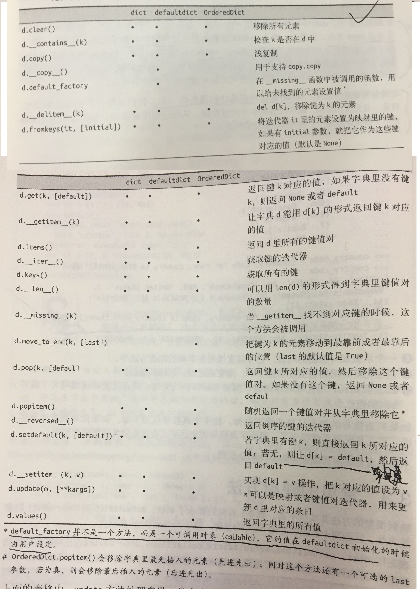
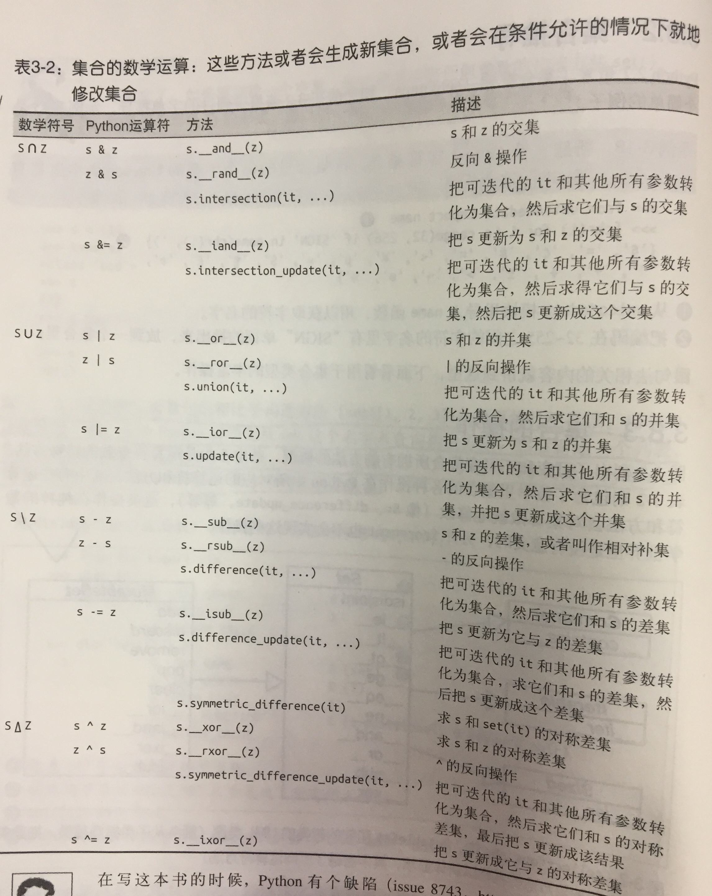
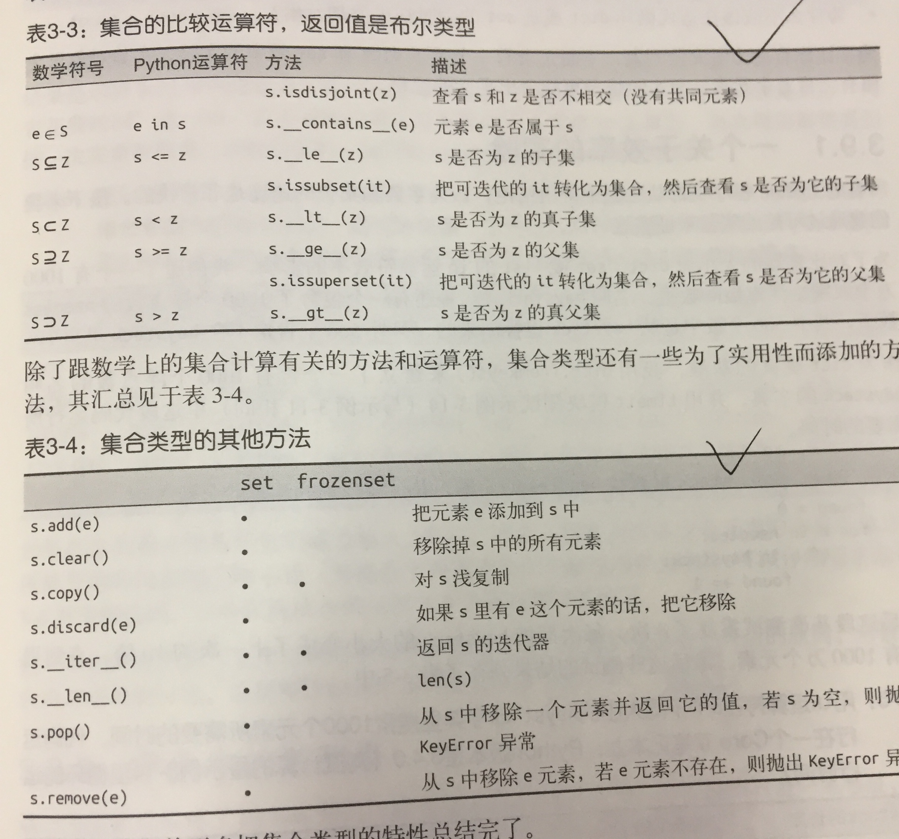

#### 本章主要内容

* 常见的字典方法
* 如何处理找不到的键
* 标准库中dict类型的变种
* set和frozenset类型
* 散列表的工作原理
* 散列表带来的影响



### 3.1 范映射类型

* 判断是不是dict
```
my_dict = {}
isinstance(my_dict, abc.Mapping)
```
* 标准库里的所有映射类型都是利用dict来实现的，因此它们有个共同的限制，只有可散列的数据类型才能用作
这些映射的键。
> 可散列类型：如果一个对象是可散列的，那么在这个对象的生命周期中，它的散列值是不可变的，
而且这个对象需要实现__hash__()方法。另外可散列对象还要有__eq__()方法，这样才能跟其他键比较。



### 3.2 字典推导
```
{code : country.upper() for country, code in country_code.items()}
```


### 3.4 常见映射方法



* update方法
```
上面表格中，update方法处理参数m的方式，是典型的“鸭子类型”。函数首先检查m是否有keys方法，如果有，
那么update函数就把它当做映射对象来处理。否则，函数会退一步，转而把m当做包含（key,value）元素的迭代器，
```

* setdefault
```
在映射对象的方法里，setdefault可能比较微妙，可以处理找不到的键

my_dict.setdefault(key, []).append(new_value) 
# 等价于
if key not in my_dict:
    my_dict[key] = []
my_dict[key].append(new_value)

关键是没有键的话会添加键
d[k] = default
这样可以实现连续操作
```



### 3.4 映射的弹性键查询

* 有时候为了方便起见，就算某个键的映射里不存在，我们也希望通过这个键读取取值的时候能得到一个默认值，
两种途径    
    * 一个通过defaultdict这个类型而不是普通dict
    * 定一个dict类，实现__missing__方法
     
     
#### defaultdict : 处理找不到的键的一个选择
* `dd = defaultdict(list)` # 如果键 `'new_key'` 不在dd中，表达式`dd['new_key']`会按照下面步骤
    * 调用`list（）`建立一个新列表；
    * 把这个新列表作为值， `new_key`作为建，放到`dd`中；
    * 返回这个列表引用；
* 所有这一切背后的功臣其实是一个特殊方法 `__missing__`，它会在 `defaultdict`遇到找不到键的时候调用 `default_factory`，
而实际上这个特性是所有映射类型都可以选择支持的
 
 
####  特殊方法 `__missing__`
* 所有的映射类型在处理找不到键的时候，都会牵扯到 `__missing__`方法，
* 虽然积累dict并没有定义这个方法，但是dict是知道有这么个东西存在的，也就是说，如果一个类继承了dict，
然后这个继承类提供了 `__missing__`方法啊，那么在 `__getitem__`找不到键的时候，python就会自动调用它。
* `__missing__`方法只会被 `__getitem__`调用（`d[k]`），对get或者__contains__（in运算符会用这个方法）这些方法的使用没有影响。


### 3.5 字典的变种

* collections.OrderdDict
* collections.ChainMap
* collections.Counter
    * 这个映射类型会给键准备一个整数计数器。每次更新一个键的时候都会增加这个计数器。
    * 所以这个类可以用来作为散列对象计数，或者当成多重集使用，
    

### 3.6 子类化UserDict

* `UserDict`并不是`dict`的子类，但是`UserDict`有一个叫做`data`属性，是`dict`实例，这个属性保存了类的最终存储数据。
```
class StrKeyDict(collections.UserDict):  

    def __missing__(self, key):  
        if isinstance(key, str):
            raise KeyError(key)
        return self[str(key)]

    def __contains__(self, key):
        return str(key) in self.data 

    def __setitem__(self, key, item):
        self.data[str(key)] = item   
```


# 3.7 不可变映射类型

* 标准库所有映射类型都是可变的，但有时候你需要不变的，比如不能让用户错误修改某个映射
* types模块引入了一个封装类名 `MappingProxyType`。如果给这个类一个映射，它会返回一个只读的映射视图，虽然是只读视图，但是它是动态的。
这意味着如果对原映射做出了改动，我们通过可以观察到，但无法通过视图修改。
```
>>> from types import MappingProxyType
>>> d = {1 : 'A'}
>>> d_proxy = MappingProxyType(d)  # 视图对象
>>> d_proxy
mappingproxy({1: 'A'})
>>> d_proxy[1]
'A'
>>> d_proxy[2] = 'X' # 不支持修改
报错，不支持修改
>>> d[2] = 'B'
>>> d_proxy # 动态可以看到修改
mappingproxy({1: 'A', 2: 'B'})
```


### 3.8 集合论

* 集合的本质是许多唯一对象的聚集，集合可以用于去重。
* 集合中的元素必须是可散列的，set本身不可散列，但是frozenset可以，因此可以创建一个包含不同frozenset的set
* 中缀表达式 
    * `a | b` 合集
    * `a & b` 交集
    * `a - b` 差集


#### 集合字面量

* 如果要创建一个空集合，必须使用 `set()`，`{}`表示空字典
* {1， 2， 3}字面量比 set([1, 2, 3])快，因为python调用构造函数，先要查询构造方法，然后创建列表，然后将列表传入构造函数，
但是字面量，python会利用专门的 BUILD_SET的字节码来创建集合

#### 集合推导







### 3.9 dict 和 set 的背后

#### 字典的散列表

* 散列表其实是一个稀疏数组，在一般的数据结构教材中，散列表里单元通常叫做表元，在dict的散列表中，每个键值
对都占一个表元，每个表元都有两部分，一个是对键的引用，一个是对值得引用。
* 散列表算法：为了获取my_dict[search_key]背后的值，python首先调用hash（search_key）计算散列值，
把这个值得最低几位作为偏移量，查找表元，如果表元为空，抛出异常，如果不为空，比较found_key == search_key为真，返回found_value
* 如果不相等，就是散列冲突，再取几位重复上面过程。

```
MAX_BITS = len(format(sys.maxsize, 'b'))
print('%s-bit Python build' % (MAX_BITS + 1))

def hash_diff(o1, o2):
    h1 = '{:>0{}b}'.format(hash(o1), MAX_BITS)
    h2 = '{:>0{}b}'.format(hash(o2), MAX_BITS)
    diff = ''.join('!' if b1 != b2 else ' ' for b1, b2 in zip(h1, h2))
    count = '!= {}'.format(diff.count('!'))
    width = max(len(repr(o1)), len(repr(o2)), 8)
    sep = '-' * (width * 2 + MAX_BITS)
    return '{!r:{width}} {}\n{:{width}} {} {}\n{!r:{width}} {}\n{}'.format(
    		o1, h1, ' ' * width, diff, count, o2, h2, sep, width=width)

if __name__ == '__main__':
    print(hash_diff(1, 1.0))
    print(hash_diff(1.0, 1.0001))
    print(hash_diff(1.0001, 1.0002))
    print(hash_diff(1.0002, 1.0003))
    
    
输出：
64-bit Python build
1        000000000000000000000000000000000000000000000000000000000000001
                                                                         != 0
1.0      000000000000000000000000000000000000000000000000000000000000001
-------------------------------------------------------------------------------
1.0      000000000000000000000000000000000000000000000000000000000000001
                        !! !   !! !! !!!   ! !!! ! !!   !!!   !          != 21
1.0001   000000000000000110100011011011100010111010110001110001000000001
-------------------------------------------------------------------------------
1.0001   000000000000000110100011011011100010111010110001110001000000001
                       ! !!!  ! !! !!  !  !!!  !!!! !  !  !  !!          != 22
1.0002   000000000000001101000110110111000101110101100011100010000000001
-------------------------------------------------------------------------------
1.0002   000000000000001101000110110111000101110101100011100010000000001
                      !!!! ! !!  !  ! !! !! !   ! !!! !! !!   !          != 23
1.0003   000000000000010011101010010010101000110000010101010011000000001
-------------------------------------------------------------------------------
```

#### dict的实现及其导致的结果

1. 键必须是可散列的
* 支持hash()函数，并通过__hash__()方法所得到的散列值是不变的
* 支持通过 `__eq__`（）方法检测相等
* 如 a==b，则 hash(a) == hash(b)
* 所有由用户自定义的对象默认都是可散列的，散列值由id（）获得，而且它们都是不相等的。
* 如果你实现了一个类的 `__eq__` 方法，并且希望它可散列，那么一定要实现 `__hash__()`方法，保证如 a==b，则 hash(a) == hash(b)。

2. 字典在内存开销巨大
* 由于字典使用了散列表，而散列表又必须是稀疏的，这导致它在空间上效率低下。
* 如果你需要存放大量巨大的记录，那么放在由元组或者具名元组构成的列表中会是比较好的选择，最好不要根据
JSON风格，用字典组成列表存放
    * 避免散列表所带来的空间开销
    * 无需把记录中的字段的名字在每个元素里都存一遍
    
#### 往字典里添加新建可能会改变已有键的顺序

* 存放元素有时会发生散列冲突，导致新的散列表的次序变化，如何发生依赖于字典背后的实现，所以，不要同时对字典进行迭代和修改。


### 3.10 本章小结

* 字典算得上是python的基石，除了基本的dict之外，标准库提供了另外几个映射类型
* 大多是映射类型都有：setdefault 和 update 方法，
    * setdefault： 存放字典里可变值，从而避免重复搜索
    * update：批量更新
* `__missing__`方法，当找不到键是，发挥作用
* collections.abc模块提供mapping和mutablemapping这两个抽象基类，利用它们，我们可以进行类型查询或者引用，
不太为人所知的mappingProxyType可以创建不可变映射对象，它封装在types模块中。
* dict和set背后的散列表效率很高。

* python的特点：简单而正确！！！



