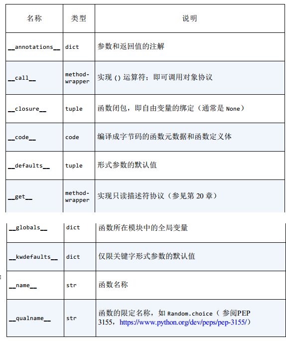

> 一等对象定义为满足下面条件的实体：
* 在运行时创建，
* 能赋值给变量或数据结构中的元素
* 能作为参数传递给函数
* 能作为函数的返回结果



### 5.1 把函数视作对象
```
>>> def factorial(n): 
... '''returns n!'''
... return 1 if n < 2 else n * factorial(n-1)

>>> factorial(42)
1405006117752879898543142606244511569936384000000000
>>> factorial.__doc__     # help 可以调用
'returns n!'
>>> type(factorial) 
<class 'function'>
```
* 函数对象的一等本性，我们可以把factorial函数赋值给变量fact，然后通过变量名调用，我们还能把它作为参数传给
map函数，map函数返回一个可迭代对象，里面的元素是把一个参数应用到第二个参数（可迭代对象）中各个元素得到结果。
```
>>> fact = factorial
>>> fact
<function factorial at 0x...>
>>> fact(5)
120
>>> map(factorial, range(11))
<map object at 0x...>
>>> list(map(fact, range(11)))
[1, 1, 2, 6, 24, 120, 720, 5040, 40320, 362880, 3628800]
```


### 5.2 高阶函数
* 接受函数作为参数，或者把函数作为结果返回的函数
```
list(map(factorial, filter(lamda n: n % 2, range(6))))  # 这里返回的是n % 2 为真的对象，1, 3, 5
```

* 内置归约函数
    * all(iterable)：如果iteration每个对象都是真值，返回True，any([])返回True。
    * any(iterable)：如果iterable中有元素为真值，返回True，any([])返回False
    

### 5.3 匿名函数
* lamda关键字是python表达式内创建匿名函数
* python简单的语法限制了lambda函数的定义体只能使用纯表达式，换句话说，lambda函数定义体不能赋值，
也不能使用while和try等python语句。
* lambda表达式重构秘笈
    * 编写注释，说明lambda表达式的作用
    * 研究一会儿注释，并找出一个名称来概括注释
    * 把lambda表达式转换成def语句，使用哪个名称定义函数
    * 删除注释


### 5.4 可调用对象
* 用户定义函数
* 内置函数
* 内置方法
* 方法
* 类
    * 调用类时运行类的__new__方法创建一个实例，然后运行__init__方法，初始化实例，最后把实例返回给调用方，
* 类的实例
    * 如果类定义了__call__方法，那么它的实例可以用于函数调用
* 生成器函数
    * 使用yield方法关键字的函数或方法，调用生成器函数返回是生成器对象
    * python中各种各样可调用对象类型，因此判断对象能否调用，最安全的方式调用内置callable()函数
    ```
    [callble(obj) for obj in (abs, str, 13)]
    ```



### 5.5 用户定义的可调用类型
```
import random
class BingoCage:
    def __init__(self, items):
        self._items = list(items) 
        random.shuffle(self._items) 
    def pick(self): 
        try:
             return self._items.pop()
        except IndexError:
            raise LookupError('pick from empty BingoCage') 
    def __call__(self): 
        return self.pick()
```
* 不仅python函数是真正的对象，任何python对象都可以表现得像函数，为此，只需要实现实例方法__call__
* 实现__call__方法的类型创建函数类对象的简便方法，此时必须内部维护一个状态，让它在调用之间可用。
* 装饰器就是这样，装饰器必须是函数，而且有时要在多次调用之间记住某些事。
* 创建保有内部状态的函数，还有一种截然不同的方法，使用闭包。


### 5.6 函数内省

```
>>> dir(factorial)
['__annotations__', '__call__', '__class__', '__closure__', '__code__',
'__defaults__', '__delattr__', '__dict__', '__dir__', '__doc__', '__eq__',
'__format__', '__ge__', '__get__', '__getattribute__', '__globals__',
'__gt__', '__hash__', '__init__', '__kwdefaults__', '__le__', '__lt__',
'__module__', '__name__', '__ne__', '__new__', '__qualname__', '__reduce__',
'__reduce_ex__', '__repr__', '__setattr__', '__sizeof__', '__str__',
'__subclasshook__']
```

* 



### 5.7 从定位参数到仅限关键字参数
```
def tag(name, *content, cls=None, **attrs):
    """生成一个或多个HTML标签"""
    if cls is not None:
        attrs['class'] = cls
    if attrs:
         attr_str = ''.join(' %s="%s"' % (attr, value)
    for attr, value
          in sorted(attrs.items()))
    else:
         attr_str = ''
    if content:
         return '\n'.join('<%s%s>%s</%s>' %
            (name, attr_str, c, name) for c in content)
    else:
            return '<%s%s />' % (name, attr_str)
```
> name是定位参数，*content接受元组，cls是仅限关键字参数，**attrs接受字典
```
>>> tag('br') ➊
'<br />'
>>> tag('p', 'hello') ➋
'<p>hello</p>'
>>> print(tag('p', 'hello', 'world'))
<p>hello</p>
<p>world</p>
>>> tag('p', 'hello', id=33) ➌
'<p id="33">hello</p>'
>>> print(tag('p', 'hello', 'world', cls='sidebar')) ➍
<p class="sidebar">hello</p>
<p class="sidebar">world</p>
>>> tag(content='testing', name="img") ➎
''
>>> my_tag = {'name': 'img', 'title': 'Sunset Boulevard',
... 'src': 'sunset.jpg', 'cls': 'framed'}
>>> tag(**my_tag) ➏
''

1. 传入单个定位参数，生成一个指名的新标签
2. 第一个参数后面任意个参数被*content捕获，存入元组
3. tag函数签名中没有明确指定名称的关键字参数会被**attrs捕获，存入一个字典
4. cls参数只能作为关键字参数传入
5. 调用tag函数时，即便第一个定位参数也能作为关键字参数传入
6. 在my_tag前面加上**，字典中的所有元素作为单个参数传入，同名键绑定到对应的具名参数上，余下则被**attrs,捕获。
```


### 5.8 获取关于参数的信息

```
import bobo

@bobo.query('/')
def hello(person):
    return 'Hello {}'.format(person)
```
* bobo.query装饰器把一个普通函数与框架的请求处理机制集成起来，这不是这个示例的关键，这里的关键是，Bobo会内省
hello函数，发现需要一个名为person的参数，然后从请求中获取那个名称的对应参数，将其传给hello函数，因此程序员根本不用碰触请求。
```
bobo -f hello.py # 启动
http://localhost:8080/?person=jim   # 访问
```
* bobo怎么知道函数需要哪个参数的呢，它又是怎么知道参数有没有默认值的呢
    * 函数对象有个__defaults__属性，它的值是一个元组，里面保存着定位参数和关键字参数的默认值，
    仅限关键字参数的默认值在__kwdefaults__属性中，然而，参数名称都在__code__属性中，它是一个code对象，
    自身有很多属性。


### 5.9 函数注解

```
def clip(text:str, max_len:'int > 0'=80) -> str: 
"""在max_len前面或后面的第一个空格处截断文本
"""
```
* 函数声明中的各个参数可以在：之后增加注解表达式；
* 注解不会做任何处理，只是存储函数的__annotations__属性中
```
>>> from clip_annot import clip
>>> clip.__annotations__
{'text': <class 'str'>, 'max_len': 'int > 0', 'return': <class 'str'>}
```
* python对注解所做的唯一的事情是，把它们存储在函数的__annotations__属性中


### 5.10 支持函数式编程的包

#### operator模块

* 在函数式编程中，经常需要把算术运算符当做函数使用
```
>>> [name for name in dir(operator) if not name.startswith('_')]
['abs', 'add', 'and_', 'attrgetter', 'concat', 'contains',
'countOf', 'delitem', 'eq', 'floordiv', 'ge', 'getitem', 'gt',
'iadd', 'iand', 'iconcat', 'ifloordiv', 'ilshift', 'imod', 'imul',
'index', 'indexOf', 'inv', 'invert', 'ior', 'ipow', 'irshift',
'is_', 'is_not', 'isub', 'itemgetter', 'itruediv', 'ixor', 'le',
'length_hint', 'lshift', 'lt', 'methodcaller', 'mod', 'mul', 'ne',
'neg', 'not_', 'or_', 'pos', 'pow', 'rshift', 'setitem', 'sub',
'truediv', 'truth', 'xor']
```
* methodclaler创建的函数会在对象上调用参数指定方法
```
>>> from operator import methodcaller
>>> s = 'The time has come'
>>> upcase = methodcaller('upper')
>>> upcase(s)
'THE TIME HAS COME'
>>> hiphenate = methodcaller('replace', ' ', '-')
>>> hiphenate(s)
'The-time-has-come'
```

* 使用functools.partial冻结参数
> functools.partial这个高阶函数用于部分应用一个函数，部分应用是指，基于一个函数创建一个新的课调用
对象，把原函数的某些参数固定。
```
>>> from operator import mul
>>> from functools import partial
>>> triple = partial(mul, 3) 
>>> triple(7) 
21
```


### 5.11 本章小结

* 本章目标是探索python函数的一等本性，这意味着，我们可以把函数赋值给变量，传给其他函数，存储在数据结构中，以及访问函数的属性，
功框架和一些工具使用
* python有7中可调用队形，从lambda表达式创建的简单函数到__call__方法的类实例，这些可调用对象都能通过
内置的callable()函数检测。