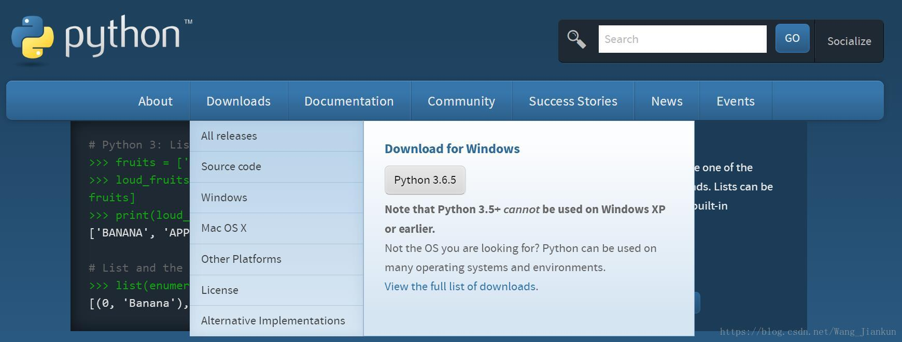
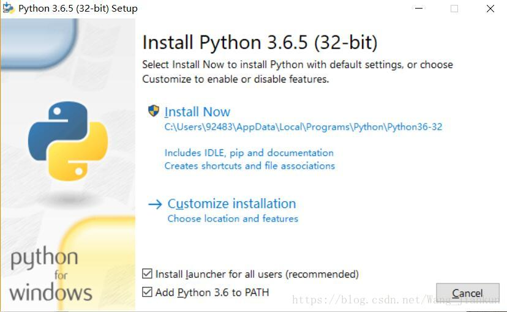

https://blog.csdn.net/Wang_Jiankun/article/details/80565719


### 安装Python：
1.下载
Python官网：https://www.python.org/
系统自动识别OS，且默认32位的Python3版本。
如果想安装其它版本的点击Downloads >> Windows，里面有其它版本。

 

2.安装
双击安装包安装，在 Add Python xx to PATH 前面打上勾，一路NEXT。

 

### 使用Python：

1.使用cmd编辑
打开cmd，输入python回车进入python环境。>>> 说明当前是在python的编辑环境下。输入 exit() 退出python环境。

 


2.IDLE编辑器
Python自带IDLE，在电脑上搜索IDLE进入。


进入IDLE就可以直接编辑了。也可以新建文件编写完代码后再运行。


3.使用pip
pip基础命令：

```
# 在cmd中使用使用pip

# 安装包
pip install packagename==version

# 升级包
pip install --upgrade packagename

# 卸载包
pip uninstall packagename

# 显示安装包信息
pip show
pip list

```

### pip 设置国内镜像：

参考：https://blog.csdn.net/jeffery0207/article/details/82965910
https://jingyan.baidu.com/article/335530dac02dc319cb41c332.html

阿里云 http://mirrors.aliyun.com/pypi/simple
中国科技大学 https://pypi.mirrors.ustc.edu.cn/simple
豆瓣(douban) http://pypi.douban.com/simple
清华大学 https://pypi.tuna.tsinghua.edu.cn/simple

中国科学技术大学 http://pypi.mirrors.ustc.edu.cn/simple