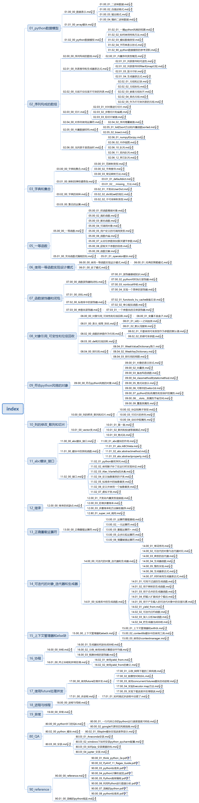

## python study 第一次迭代




## 遇到的问题

### python版本配置

1. 环境变量：在path目录下加入存在 Python.exe 的目录
```
C:\Anaconda2
C:\Anaconda2\script
```
* 如果存在多个python版本， 只需要在另一个版本中将python.exe 改为 python3.5.exe就可以进行下面操作
```
python -V   #  2.7
python3.5 -V  # 3.5
```
* 使用 pip 安装,可以采用
```
python -m pip instal package
python3.5 -m pip install package
```


## python study 第二次迭代 《流利的python》 系统学习

* 最后17/18 设计并发，没有看
* 元编程设计数据库没有看。


## python study 第三次迭代 《python标准程序库》


